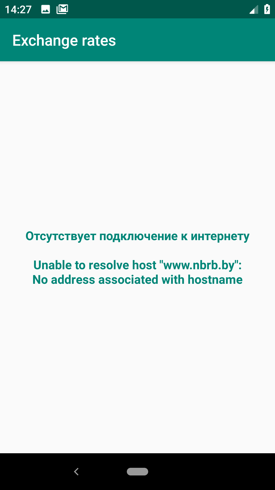
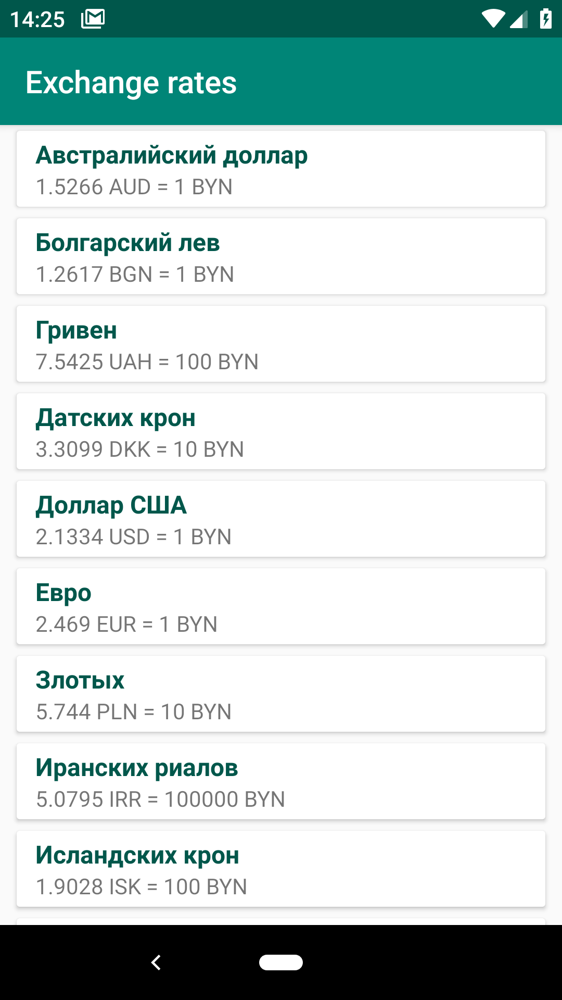
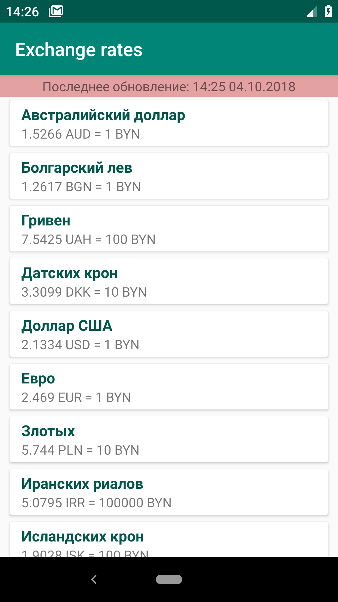
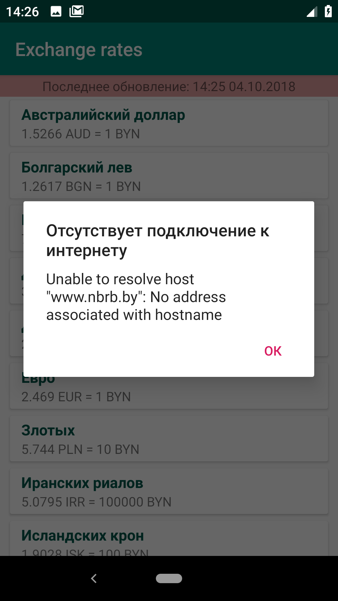

# [NBRB](https://www.nbrb.by/engl) exchange rates 

**NBRB-Rates** - application written in Kotlin. Based on MVVM architecture using [Android Architecture components](https://developer.android.com/topic/libraries/architecture/) (LiveData, ModelView).

The application load all available exchange rates from [NBRB-endpoint](http://www.nbrb.by/Services/XmlExRates.aspx). It also able to handle exceptions. RecyclerView adapter allows to change items order.

 * MVVM
 * Kotlin coroutines
 * Android Architecture Components
    * LiveData
    * Room
    * ViewModel
 * Dagger2

## Screenshots

  
  
  
  
 

